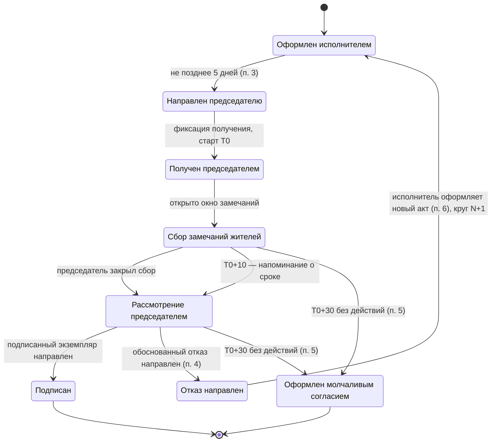

# Правки к системным требованиям (разделы 3–6 + точечные правки)

> Это протокол правок, внесённых поверх первой версии системных требований
> (сохранена как [original/system-requirements-v1.pdf](original/system-requirements-v1.pdf)).
> Все изменения из этого файла уже применены в актуальном документе
> [requirements.md](requirements.md) — читайте этот файл, если нужно понять
> **почему** требование сформулировано именно так, а не иначе.
>
> Обозначения: **ИЗМ** — переработано, **НОВ** — добавлено, ~~зачёркнутое~~ —
> удалено с указанием причины.

---

## 3. MoSCoW-приоритизация (ИЗМ)

### Must have — MVP хакатона

| Функциональность | Почему здесь |
|---|---|
| Роли председатель/житель, привязка пользователя к дому | Разный функционал по роли |
| **Загрузка акта председателем** (ИЗМ: не УК) | Нулевой барьер пилота: старт без договорённости с УК |
| **Разбор акта на позиции** (НОВ) | Возражения по п. 4 приказа заявляются против содержимого акта, т.е. против конкретных строк |
| Карточка акта и фиксация даты/времени получения | Требование п. 3 приказа о подтверждении получения |
| Расчёт и отсчёт сроков 10/30 дней | Ядро ценности: не пропустить необратимый 30-й день |
| Проактивные уведомления по схеме 0–10–25–30 | Без них председатель пропустит срок |
| **Чек-лист позиций для жителей: «ок / есть претензия»** (ИЗМ: вместо свободной формы) | Решает релевантность формой ввода, а не фильтром; даёт LLM структуру |
| **Фотоподтверждение замечания** (ИЗМ: было Won't) | Единственное, что наполняет требование «аргументированные возражения» |
| Формализация замечаний LLM в формулировку факта | Превращает бытовой текст в документ |
| **Справочник оснований по видам работ** (НОВ) | Основание возражения модель не выдумывает, а берёт из справочника |
| Генерация PDF: подписываемый экземпляр и **частичный по умолчанию** мотивированный отказ (ИЗМ) | Отказ «по позиции 3 возражаю, по остальным нет» защищён лучше тотального |
| Машина состояний акта и журнал событий | Доказательная база и предсказуемость |

### Should have

| Функциональность | Почему здесь |
|---|---|
| **Подпись через Госключ** (ИЗМ: было Must) | Юридическая значимость, но контур недоступен на хакатоне; MVP работает без него |
| **Сценарий «акт не поступил»**: контроль срока по п. 2–3 и шаблон запроса в УК (НОВ) | Норме три недели, часть УК ещё не рассылает акты |
| **Цепочка кругов: связь нового акта с предыдущим отказом** (НОВ) | П. 6 перезапускает цикл; это и есть неучтённая никем часть процесса |
| Дедупликация и метка нерелевантности замечаний | Снижает шум, MVP работает и без неё |
| Пояснение «что проверить» по каждой позиции | Повышает качество решений |
| История актов по дому и экспорт PDF | Доказательная база |
| Уведомление УК о результате приёмки | Замыкает контур |

### Could have

Интеграция с ГИС ЖКХ для связки дом–УК–председатель; приём акта напрямую от
УК (кабинет/интеграция); шаблоны типовых возражений; мультидомовость;
аналитика по срокам для советов и ГЖИ.

### Won't have

| Что | Почему |
|---|---|
| ТСЖ, ЖСК и дома без совета МКД | **ИЗМ (обоснование исправлено):** по ч. 1 ст. 161.1 ЖК РФ совет МКД не создаётся, если в доме есть ТСЖ или домом управляет ЖСК, — в этих домах отсутствует подписант из приказа. Приказ при этом может применяться, если ТСЖ заключило договор управления с УК, но акт подписывает правление |
| ~~Фотоподтверждение~~ | **Удалено из Won't.** Прежнее обоснование («не входит в форму акта № 761/пр») нерелевантно: фото прикладывается не к акту, а к отказу, форма которого не регламентирована |
| ~~Workflow совместного осмотра~~ | **Удалено.** Совместного осмотра в приказе № 318/пр нет; формулировка была из проекта. По п. 6 после отказа стороны оформляют новый акт по пп. 3–5 |
| Кабинет УК с биллингом, электронное голосование ОСС | Отдельные продукты |

---

## 4. Функциональные требования (ИЗМ)

### Модуль A. Идентификация и роли

- **FR-A1.** Роль (председатель / житель) определяется привязкой пользователя к дому.
- **FR-A2.** Пользователю показываются только разрешённые ролью действия.
- **FR-A3.** Поддерживается совмещение ролей.
- **FR-A4 (НОВ).** В MVP статус председателя самозаявленный, подтверждается оператором вручную; система хранит основание полномочий (протокол ОСС / доверенность) как текстовое поле без проверки.

### Модуль B. Карточка акта

- **FR-B1 (ИЗМ).** Председатель загружает полученный акт (PDF или фото); система создаёт карточку, привязанную к дому.
- **FR-B1.1 (НОВ).** Система распознаёт табличную часть акта по форме № 761/пр и создаёт перечень позиций акта: номер, наименование работы, периодичность, объём, стоимость.
- **FR-B1.2 (НОВ).** Председатель может отредактировать распознанные позиции до старта сбора замечаний.
- **FR-B2.** Система фиксирует дату и время получения акта председателем.
- **FR-B3 (ИЗМ).** По каждой позиции отображается человекочитаемое пояснение «что проверить».
- **FR-B4.** Статус акта виден участникам дома согласно роли.
- **FR-B5 (НОВ).** Если по дому не поступил акт за период, предусмотренный договором, система уведомляет председателя и предлагает шаблон запроса в УК (Should).

### Модуль C. Сроки и уведомления

- **FR-C1 (ИЗМ).** Система хранит контрольные даты: дата получения (T0), T0+10 (окончание срока по п. 4), T0+30 (молчаливое согласие по п. 5). Срок «не позднее 5 дней» (п. 3) используется только для контроля действий исполнителя.
- **FR-C2.** Председателю отображаются оба счётчика: до 10-го и до 30-го дня, с пояснением разницы («срок по приказу истёк, но акт ещё не считается принятым»).
- **FR-C3 (ИЗМ).** График уведомлений: старт окна (T0), напоминание на T0+7, уведомление о наступлении процедурного срока (T0+10), напоминание T0+25, финальные предупреждения T0+28 и T0+29.
- **FR-C4.** По истечении 30 дней без действий система переводит акт в статус «оформлен молчаливым согласием» и уведомляет стороны.
- **FR-C5 (НОВ).** Таймеры работают независимо от доставки уведомлений; недоставленное уведомление не должно приводить к незаметному наступлению 30-го дня (см. NFR-5).

### Модуль D. Замечания жителей

- **FR-D1 (ИЗМ).** Житель видит перечень позиций акта и по каждой выбирает «выполнено» / «есть претензия».
- **FR-D2 (ИЗМ).** При выборе «есть претензия» житель вводит комментарий и может приложить фото; замечание привязывается к позиции акта, автору и времени.
- **FR-D3 (ИЗМ).** Окно сбора замечаний закрывается решением председателя или наступлением T0+30 — в зависимости от того, что раньше. Жёсткий интервал в 7 дней не используется.
- **FR-D4 (НОВ).** Система хранит метаданные фото: время загрузки, автор, позиция акта, порядковый номер в реестре приложений.
- **FR-D5 (НОВ).** Житель видит агрегированную картину по позиции («7 из 9 ответивших: не выполнено»), но не персональные данные других жителей.

### Модуль E. Обработка замечаний

- **FR-E1 (ИЗМ).** Система формализует комментарий жителя в формулировку слота «Фактически»: что именно не выполнено или выполнено с недостатками. LLM не формирует основание и не оценивает правомерность.
- **FR-E2 (НОВ).** Основание возражения подставляется из справочника по виду работ (договор управления, ПП РФ № 290, приказ Госстроя № 170 и др.); справочник редактируется оператором.
- **FR-E3.** Схожие замечания по одной позиции группируются и дедуплицируются (Should).
- **FR-E4.** Потенциально нерелевантные замечания помечаются, но не удаляются без решения председателя (Should).
- **FR-E5 (ИЗМ).** Если по позиции нет ни одного замечания с подтверждением, система не формирует возражение и сообщает председателю, что оснований недостаточно.

### Модуль F. Подписание и отправка

- **FR-F1 (ИЗМ).** Система формирует готовый к подписанию PDF-экземпляр акта и PDF отказа. Отправка исполнителю выполняется способом, согласованным сторонами (в MVP — выгрузка файла и отправка по email).
- **FR-F2 (ИЗМ, Should).** Подписание квалифицированной ЭП через Госключ; при недоступности контура сценарий завершается формированием файла.
- **FR-F3.** Фиксируются дата, время и субъект действия.

### Модуль G. Мотивированный отказ

- **FR-G1 (ИЗМ).** Отказ формируется как частичный: перечисляются только оспариваемые позиции, по остальным явно указывается отсутствие возражений.
- **FR-G2 (ИЗМ).** По каждой оспариваемой позиции документ содержит четыре элемента: позиция акта → фактическое положение → основание → требование; к документу прикладывается пронумерованный реестр фотоматериалов и сводка отметок жителей.
- **FR-G3.** Председатель редактирует и подтверждает проект перед формированием документа. Формирование без явного подтверждения невозможно.
- **FR-G4 (ИЗМ).** После направления отказа акт переходит в статус «отказ направлен, ожидается новый акт»; ~~совместный осмотр~~ не предусмотрен приказом.
- **FR-G5 (НОВ).** Новый акт по той же услуге связывается с предыдущим; система хранит номер круга и переносит непринятые возражения в подсказки председателю.

---

## 5. Жизненный цикл акта (ИЗМ)

**Логика таймеров.** От момента получения работают два счётчика: процедурный
срок 10 дней (п. 4) и защитный дедлайн 30 дней (п. 5), по истечении которого
акт считается оформленным. Внутренние интервалы сбора замечаний жёстко не
задаются: окно открыто с T0 и закрывается решением председателя либо на
T0+30. Бот подводит председателя к решению к 10-му дню и наращивает
срочность предупреждений к 30-му. Состояние `Rejected` не терминальное: по
п. 6 цикл перезапускается новым актом, число кругов не ограничено.

---

## 6. Модель данных (ИЗМ)

| Сущность | Ключевые поля | Источник |
|---|---|---|
| Пользователь | id в MAX, ФИО, контакт, роли, привязка к дому | Регистрация в боте |
| Дом (МКД) | адрес, идентификатор в реестре, УК, наличие совета | Ручной ввод; ГИС ЖКХ — Could |
| УК (исполнитель) | наименование, ИНН, № лицензии, согласованный способ обмена | Ручной ввод |
| Председатель | пользователь, дом, основание полномочий, срок | Самозаявление + подтверждение оператором |
| **Акт** | id, дом, тип, период, дата оформления, **дата получения (T0)**, T0+10, T0+30, статус, файл, **предыдущий акт (ссылка), номер круга** (НОВ) | Загрузка председателем |
| **Позиция акта** (НОВ) | id, акт, номер строки, наименование работы, периодичность, объём, стоимость, решение председателя (принять / оспорить) | Распознавание бланка + правка |
| **Замечание** (ИЗМ) | id, позиция акта, автор, исходный текст, формализованный текст, метка релевантности, статус | Житель + модуль обработки |
| **Вложение** (НОВ) | id, замечание, файл, время загрузки, автор, номер в реестре приложений | Житель |
| **Основание** (НОВ) | id, вид работы, нормативная ссылка, формулировка | Справочник оператора |
| Мотивированный отказ | id, акт, перечень возражений (позиция + факт + основание + требование), реестр приложений, редакции, подпись, время | Модуль отказа |
| Событие (аудит) | id, акт, тип, субъект, время | Система |

**Связка дом–УК–председатель** остаётся критической зависимостью, но в MVP
закрывается самозаявлением председателя и демо-справочником: акт в систему
приносит сам председатель, поэтому адресация не требуется. Интеграция с
ГИС ЖКХ нужна на этапе пилота, для онбординга без ручного ввода.

---

## Точечные правки вне разделов 3–6

- **Раздел 9, допущения.** Убрана формулировка «председатель и активные
  жители имеют доступ к Госключу» — MVP от этого больше не зависит.
  Добавлено: «связка дом–УК–председатель в MVP самозаявленная, проверка
  полномочий не выполняется» и «распознавание бланка проверено на N
  образцах формы № 761/пр».
- **Раздел 1, нормативная основа.** Ссылка на письмо Минстроя от 13.08.2026
  № 50270-ДН/04 изначально не была подтверждена — при подготовке этого
  протокола реквизиты требовалось проверить или убрать до защиты.
  **Обновление 2026-09-24:** письмо подтверждено веб-сверкой (КонсультантПлюс,
  cons_doc_LAW_541943); оно же подтверждает нашу область применения (ТСЖ/
  кооперативы вне scope) и уточняет, что повторный акт после отказа может
  отличаться по составу/объёму работ — см. requirements.md, раздел 1 и раздел
  10.
- **Раздел NFR-8.** Формулировка «тиражирование без региональной адаптации»
  заменена на разделение: неизменны норма, сроки, форма акта, логика
  сценария и архитектура; адаптируются перечень работ и периодичность из
  договора управления конкретного дома и справочник оснований по видам
  работ. Это то, что спрашивают по критерию масштабирования.

---

## 2026-09-24 — веб-сверка открытых вопросов + генерация документа отказа

- **Раздел 10.** Пять из шести открытых вопросов закрыты или частично
  закрыты веб-поиском: MAX Bot API (домен, авторизация, webhook/polling —
  подтверждены; типы кнопок остались уточнить), Госключ (рекомендован
  готовый коннектор Астрал/Диадок вместо интеграции с ЕСИА с нуля), ГИС ЖКХ
  (бесплатного API со связкой дом–УК–совет нет, MVP на ручном справочнике
  оправдан), форма мотивированного отказа (реквизиты внесены в FR-G2),
  письмо № 50270-ДН/04 (подтверждено). LLM выбран — GigaChat (см. ниже).
- **Раздел 7, интеграции.** Строки MAX Bot API / Госключ / ГИС ЖКХ дополнены
  найденными техническими деталями и рекомендацией не поднимать интеграцию
  с ЕСИА с нуля на хакатон.
- **LLM = GigaChat (НОВ, закрывает открытый вопрос 5).** Причина не
  «российская для галочки»: NFR-2 (152-ФЗ, хранение ПДн в РФ) исключает
  зарубежные API для текста замечаний жителей. GigaChat закрывает оба
  сценария одним провайдером — обычный чат для FR-E1 и отдельная функция
  `table` для распознавания акта (FR-B1.1). Если акт приходит чистым PDF —
  сначала пробовать детерминированный PDF-парсинг, `table`/vision — только
  для сфотографированных актов (не тратить LLM-вызов, когда не нужно).
- **FR-G2.1 (НОВ).** Уточнение по мотивированному отказу: фотографии
  встраиваются в тело итогового PDF как пронумерованные страницы-приложения,
  а не только упоминаются ссылкой в текстовом реестре — сильнее как
  доказательная база в споре с УК/ГЖИ.
- **FR-G6 (НОВ, механика генерации).** Явно зафиксировано разделение
  ответственности: LLM формулирует только текст возражений (FR-E1);
  сборка итогового PDF (макет, реквизиты, вставка страниц с фото) —
  детерминированный рендеринг PDF-библиотекой, без LLM в контуре вёрстки.
  Это и надёжнее (не полагаемся на LLM в точности форматирования
  юридического документа), и дешевле по токенам.
