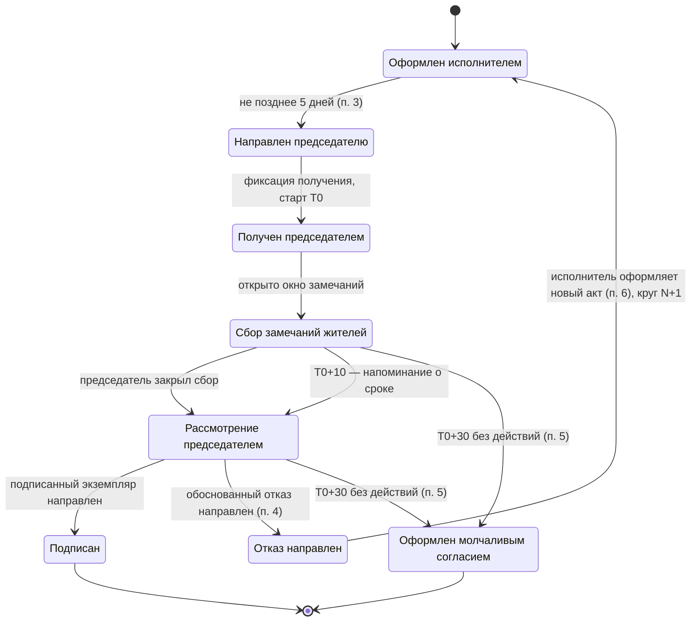

# Бот приёмки актов МКД в MAX — системные требования

> Актуальная версия (v2), объединяет исходный документ и правки из
> [requirements-changelog.md](requirements-changelog.md). История принятия
> решений и нормативный разбор — в [idea.md](idea.md) и
> [pitch-analysis.md](pitch-analysis.md). Задачи по реализации — в
> [tasks.md](tasks.md). Исходная версия v1 — [original/system-requirements-v1.pdf](original/system-requirements-v1.pdf).

2026-09-24 · рабочая версия команды

## 1. Контекст, цель и нормативная основа

**Проблема.** С 1 сентября 2026 года приёмка услуг и работ по содержанию и
текущему ремонту общего имущества МКД впервые регулируется единым
обязательным федеральным порядком со сроками и механизмом «молчаливого
согласия». Ответственность за своевременную приёмку ложится на председателя
совета МКД — как правило, непрофессионала без юридической подготовки.
Готового инструмента под новую норму нет: обмен идёт бумажными письмами,
почтой, при личных встречах.

**Цель продукта.** Дать председателю совета МКД возможность принять или
аргументированно отклонить акт приёмки прямо в мессенджере MAX — в срок, без
чтения нормативных документов и без юриста, с автоматическим сбором
замечаний жильцов и генерацией мотивированного отказа.

**Нормативная основа.** Приказ Минстроя России № 318/пр от 22.05.2026
(зарегистрирован в Минюсте 01.06.2026, № 86764), действует с 01.09.2026 до
01.09.2032. Издан во исполнение Федерального закона от 29.12.2025 № 529-ФЗ,
внёсшего соответствующие изменения в ЖК РФ. Форма акта не меняется —
применяется форма из приказа № 761/пр от 26.10.2015. Полномочия председателя
подписывать акты — п. 4 ч. 8 ст. 161.1 ЖК РФ. Разъяснения — письмо Минстроя
России от 13.08.2026 № 50270-ДН/04 «О положениях приказа Минстроя России от
22.05.2026 № 318/пр» (подтверждено, КонсультантПлюс cons_doc_LAW_541943).

> Письмо-разъяснение прямо подтверждает нашу область применения (раздел 9):
> порядок обязателен только при избранном совете МКД, на ТСЖ и кооперативы
> не распространяется. Также уточняет, что новый акт после отказа (п. 6)
> может отличаться от первоначального по составу и объёму работ/услуг, а
> перед повторным оформлением стороны вправе (не обязаны) провести
> консультации/осмотр — это не формальный шаг процесса, а опциональная
> практика сторон вне системы.

**Ключевые сроки по приказу (ядро логики бота):** исполнитель направляет два
экземпляра акта председателю не позднее 5 дней со дня оформления акта,
способом с подтверждением получения; у председателя 10 дней со дня получения
на подпись либо письменный обоснованный отказ; если по истечении 30 дней со
дня получения не поступил ни подписанный экземпляр, ни отказ — акт считается
подписанным (30-дневный срок включает 10-дневный).

## 2. Роли пользователей и права доступа

Функционал бота зависит от роли: председатель принимает решения по акту,
житель только вносит замечания. Роль определяется по привязке пользователя к
дому (см. раздел 6). Один человек может быть одновременно жителем и
председателем — тогда доступны оба набора действий.

| Роль | Кто это | Доступные действия | Недоступно |
|---|---|---|---|
| **Председатель** | Полномочный подписант акта (доверенности собственников или решение ОСС) | Просмотр акта и статуса; таймеры сроков; чтение агрегированных замечаний; «Подписать» (Госключ, Should); «Сформировать мотивированный отказ»; редактирование черновика отказа | Не может подписывать за другой дом |
| **Житель / собственник** | Собственник помещения в этом МКД | Просмотр позиций акта и пояснений «что проверить»; отметка «выполнено / есть претензия» по позиции + фото; просмотр агрегированного статуса без чужих персональных данных | Не видит кнопок подписи/отказа; не может подписать или отклонить акт |
| **Исполнитель (УК / подрядчик)** | Лицо, обязанное оказывать услуги по договору управления | В MVP получает результат вне системы (email/файл); в перспективе — направляет акт в систему | В MVP не участвует в чате дома; не редактирует замечания жителей |
| **Администратор системы** | Оператор сервиса | Управление справочником дом–УК–председатель, справочником оснований по видам работ; подтверждение статуса председателя; модерация; поддержка | Не имеет доступа к подписи от имени пользователей |

## 3. MoSCoW-приоритизация

Must have — минимум, без которого продукт не решает задачу и не
соответствует приказу № 318/пр; именно его показываем как MVP на хакатоне.
Should/Could — дорожная карта. Won't — сознательно вне scope этого этапа.

### Must have — MVP хакатона

| Функциональность | Почему здесь |
|---|---|
| Роли председатель/житель, привязка пользователя к дому | Разный функционал по роли |
| Загрузка акта председателем (не УК) | Нулевой барьер пилота: старт без договорённости с УК |
| Разбор акта на позиции | Возражения по п. 4 приказа заявляются против содержимого акта, т.е. против конкретных строк |
| Карточка акта и фиксация даты/времени получения | Требование п. 3 приказа о подтверждении получения |
| Расчёт и отсчёт сроков 10/30 дней | Ядро ценности: не пропустить необратимый 30-й день |
| Проактивные уведомления по схеме 0–10–25–30 | Без них председатель пропустит срок |
| Чек-лист позиций для жителей: «ок / есть претензия» | Решает релевантность формой ввода, а не фильтром; даёт LLM структуру |
| Фотоподтверждение замечания | Единственное, что наполняет требование «аргументированные возражения» |
| Формализация замечаний LLM в формулировку факта | Превращает бытовой текст в документ |
| Справочник оснований по видам работ | Основание возражения модель не выдумывает, а берёт из справочника |
| Генерация PDF: подписываемый экземпляр акта и частичный (по умолчанию) мотивированный отказ | Отказ «по позиции 3 возражаю, по остальным нет» защищён лучше тотального |
| Машина состояний акта и журнал событий | Доказательная база и предсказуемость |

### Should have

| Функциональность | Почему здесь |
|---|---|
| Подпись через Госключ | Юридическая значимость, но контур недоступен на хакатоне; MVP работает без него |
| Сценарий «акт не поступил»: контроль срока по п. 2–3 и шаблон запроса в УК | Норме несколько недель, часть УК ещё не рассылает акты |
| Цепочка кругов: связь нового акта с предыдущим отказом | П. 6 перезапускает цикл; неучтённая часть процесса |
| Дедупликация и метка нерелевантности замечаний | Снижает шум, MVP работает и без неё |
| Пояснение «что проверить» по каждой позиции | Повышает качество решений |
| История актов по дому и экспорт PDF | Доказательная база |
| Уведомление УК о результате приёмки | Замыкает контур |

### Could have

Интеграция с ГИС ЖКХ для связки дом–УК–председатель; приём акта напрямую от
УК (кабинет/интеграция); шаблоны типовых возражений; мультидомовость;
аналитика по срокам для советов и ГЖИ.

### Won't have

| Что | Почему |
|---|---|
| ТСЖ, ЖСК и дома без совета МКД | По ч. 1 ст. 161.1 ЖК РФ совет МКД не создаётся, если в доме есть ТСЖ или домом управляет ЖСК — в этих домах отсутствует подписант из приказа. Приказ может применяться, если ТСЖ заключило договор управления с УК, но акт подписывает правление |
| Workflow совместного осмотра | Обязательного шага в приказе № 318/пр нет (формулировка была из проекта приказа). Письмо-разъяснение № 50270-ДН/04 допускает, что стороны *вправе* провести консультации/осмотр перед повторным актом, но это их договорённость вне системы, не формальный шаг процесса. По п. 6 после отказа стороны оформляют новый акт по пп. 3–5, который может отличаться по составу/объёму работ |
| Кабинет УК с биллингом и начислениями | Отдельный продукт |
| Электронное голосование ОСС | Вне задачи приёмки актов |

## 4. Функциональные требования

Требования сгруппированы по модулям. Приоритет каждого — по разделу 3.
Формулировки — как проверяемые требования к системе.

### Модуль A. Идентификация и роли

- **FR-A1.** Система определяет роль пользователя (председатель / житель) по его привязке к дому из справочника (раздел 6).
- **FR-A2.** Система показывает пользователю только те действия, которые разрешены его ролью.
- **FR-A3.** Система поддерживает пользователя с двумя ролями одновременно (житель + председатель).
- **FR-A4.** В MVP статус председателя самозаявленный, подтверждается оператором вручную; система хранит основание полномочий (протокол ОСС / доверенность) как текстовое поле без проверки.

### Модуль B. Карточка акта

- **FR-B1.** Председатель загружает полученный акт (PDF или фото); система создаёт карточку акта, привязанную к дому.
- **FR-B1.1.** Система распознаёт табличную часть акта по форме № 761/пр и создаёт перечень позиций акта: номер, наименование работы, периодичность, объём, стоимость.
- **FR-B1.2.** Председатель может отредактировать распознанные позиции до старта сбора замечаний.
- **FR-B2.** Система фиксирует дату и время получения акта председателем способом, подтверждающим получение.
- **FR-B3.** По каждой позиции отображается человекочитаемое пояснение «что проверить».
- **FR-B4.** Статус акта виден всем участникам дома в соответствии с их ролью.
- **FR-B5.** Если по дому не поступил акт за период, предусмотренный договором, система уведомляет председателя и предлагает шаблон запроса в УК (Should).

### Модуль C. Сроки и уведомления

- **FR-C1.** Система хранит контрольные даты: дата получения (T0), T0+10 (окончание срока по п. 4), T0+30 (молчаливое согласие по п. 5). Срок «не позднее 5 дней» (п. 3) используется только для контроля действий исполнителя.
- **FR-C2.** Председателю отображаются оба счётчика — до 10-го и до 30-го дня, с пояснением разницы («срок по приказу истёк, но акт ещё не считается принятым»).
- **FR-C3.** График уведомлений: старт окна (T0), напоминание на T0+7, уведомление о наступлении процедурного срока (T0+10), напоминание T0+25, финальные предупреждения T0+28 и T0+29.
- **FR-C4.** По истечении 30 дней без действий система переводит акт в статус «оформлен молчаливым согласием» и уведомляет стороны.
- **FR-C5.** Таймеры работают независимо от доставки уведомлений; недоставленное уведомление не должно приводить к незаметному наступлению 30-го дня (см. NFR-5).

### Модуль D. Замечания жителей

- **FR-D1.** Житель видит перечень позиций акта и по каждой выбирает «выполнено» / «есть претензия».
- **FR-D2.** При выборе «есть претензия» житель вводит комментарий и может приложить фото; замечание привязывается к позиции акта, автору и времени.
- **FR-D3.** Окно сбора замечаний закрывается решением председателя или наступлением T0+30 — в зависимости от того, что раньше. Жёсткий интервал в 7 дней не используется.
- **FR-D4.** Система хранит метаданные фото: время загрузки, автор, позиция акта, порядковый номер в реестре приложений.
- **FR-D5.** Житель видит агрегированную картину по позиции («7 из 9 ответивших: не выполнено»), но не персональные данные других жителей.

### Модуль E. Обработка замечаний

- **FR-E1.** Система формализует комментарий жителя в формулировку слота «Фактически»: что именно не выполнено или выполнено с недостатками. LLM не формирует основание и не оценивает правомерность.
- **FR-E2.** Основание возражения подставляется из справочника по виду работ (договор управления, ПП РФ № 290, приказ Госстроя № 170 и др.); справочник редактируется оператором.
- **FR-E3.** Схожие замечания по одной позиции группируются и дедуплицируются (Should).
- **FR-E4.** Потенциально нерелевантные замечания помечаются, но не удаляются без решения председателя (Should).
- **FR-E5.** Если по позиции нет ни одного замечания с подтверждением, система не формирует возражение и сообщает председателю, что оснований недостаточно.

### Модуль F. Подписание и отправка

- **FR-F1.** Система формирует готовый к подписанию PDF-экземпляр акта и PDF отказа. Отправка исполнителю выполняется способом, согласованным сторонами (в MVP — выгрузка файла и отправка по email).
- **FR-F2 (Should).** Подписание квалифицированной ЭП через Госключ; при недоступности контура сценарий завершается формированием файла.
- **FR-F3.** Фиксируются дата, время и субъект действия.

### Модуль G. Мотивированный отказ

- **FR-G1.** Отказ формируется как частичный: перечисляются только оспариваемые позиции, по остальным явно указывается отсутствие возражений.
- **FR-G2.** По каждой оспариваемой позиции документ содержит четыре элемента: позиция акта → фактическое положение → основание → требование; к документу прикладывается пронумерованный реестр фотоматериалов (встраивание — см. FR-G2.1) и сводка отметок жителей. Обязательные реквизиты документа в целом (сверено с типовой формой мотивированного отказа): номер и дата исходного акта, наименование и адрес УК, её представитель, ФИО/должность и подпись председателя, факт уведомления УК об отказе, дата/время/место составления.
- **FR-G2.1.** Фотографии, приложенные жителями к оспариваемым позициям, встраиваются в тело итогового PDF как пронумерованные страницы-приложения — не только ссылкой или списком файлов. Каждая страница подписана: номер в реестре, позиция акта, к которой относится фото, автор и дата загрузки. Текстовый реестр приложений (оглавление) предшествует самим страницам с фото.
- **FR-G3.** Председатель редактирует и подтверждает проект перед формированием документа. Формирование без явного подтверждения невозможно.
- **FR-G4.** После направления отказа акт переходит в статус «отказ направлен, ожидается новый акт» (совместный осмотр приказом не предусмотрен).
- **FR-G5.** Новый акт по той же услуге связывается с предыдущим; система хранит номер круга и переносит непринятые возражения в подсказки председателю.
- **FR-G6 (механика генерации).** Формирование документа — двухшаговый конвейер, не единый вызов LLM: (1) сборка структурированных данных по каждой оспариваемой позиции — факт из FR-E1 (LLM), основание из справочника FR-E2 (не LLM), требование по шаблону вида позиции — в промежуточный объект отказа; (2) детерминированный рендеринг PDF из этого объекта через шаблон документа (реквизиты — FR-G2) PDF-библиотекой, без участия LLM в вёрстке. LLM отвечает только за формулировки текста возражений, не за макет и не за сборку файла. Страницы с фото (FR-G2.1) добавляются рендерером после текстовой части.

## 5. Жизненный цикл акта (машина состояний)

Акт проходит фиксированную последовательность состояний; переходы
управляются действиями сторон и сроками из приказа. Терминальные
состояния — «Подписан» и «Оформлен молчаливым согласием».

**Логика таймеров.** От момента получения работают два вложенных счётчика:
процедурный срок 10 дней (п. 4) и защитный дедлайн 30 дней (п. 5), по
истечении которого акт считается оформленным. Внутренние интервалы сбора
замечаний жёстко не задаются: окно открыто с T0 и закрывается решением
председателя либо на T0+30. Бот подводит председателя к решению к 10-му дню
и наращивает срочность предупреждений к 30-му. Состояние `Rejected` не
терминальное: по п. 6 цикл перезапускается новым актом, число кругов не
ограничено.

## 6. Модель данных и источники

Центральная связка — дом ↔ УК ↔ председатель: она определяет роль
пользователя и адресата акта. В MVP закрывается самозаявлением председателя
и демо-справочником (акт в систему приносит сам председатель, поэтому
адресация не требуется); целевой источник для пилота — ГИС ЖКХ (реестр
домов, управляющих организаций, сведения о советах МКД). Персональные данные
обрабатываются по 152-ФЗ (см. раздел 8).

| Сущность | Ключевые поля | Источник |
|---|---|---|
| Пользователь | id в MAX, ФИО, контакт, роли, привязка к дому | Регистрация в боте |
| Дом (МКД) | адрес, идентификатор в реестре, УК, наличие совета | Ручной ввод; ГИС ЖКХ — Could |
| УК (исполнитель) | наименование, ИНН, № лицензии, согласованный способ обмена | Ручной ввод |
| Председатель | пользователь, дом, основание полномочий, срок | Самозаявление + подтверждение оператором |
| Акт | id, дом, тип, период, дата оформления, дата получения (T0), T0+10, T0+30, статус, файл, предыдущий акт (ссылка), номер круга | Загрузка председателем |
| Позиция акта | id, акт, номер строки, наименование работы, периодичность, объём, стоимость, решение председателя (принять / оспорить) | Распознавание бланка + правка |
| Замечание | id, позиция акта, автор, исходный текст, формализованный текст, метка релевантности, статус | Житель + модуль обработки |
| Вложение | id, замечание, файл, время загрузки, автор, номер в реестре приложений | Житель |
| Основание | id, вид работы, нормативная ссылка, формулировка | Справочник оператора |
| Мотивированный отказ | id, акт, перечень возражений (позиция + факт + основание + требование), реестр приложений, редакции, подпись, время | Модуль отказа |
| Событие (аудит) | id, акт, тип события, субъект, время | Система |

## 7. Интеграции

Четыре внешние зависимости. Для хакатона критичны первые две; ГИС ЖКХ и
полноценный контур ЭП можно заменить заглушками с честной пометкой в демо
(Госключ и так понижен до Should — см. раздел 3).

| Интеграция | Назначение | Ключевые требования |
|---|---|---|
| MAX Bot API | Канал доставки, кнопки, роли, уведомления | REST API на `platform-api2.max.ru`, токен в заголовке `Authorization` (не в query); события — `POST /subscriptions` (webhook) или `GET /updates` (long polling); `user_id`/`chat_id` для идентификации; официальные SDK — Go, Python, Node.js (`@maxhub/max-bot-api`); лимит запросов, HTTP 429 при превышении |
| Госключ (КЭП) | Юридически значимая подпись акта и отказа | Интеграция через ЕСИА REST API либо через готовый коннектор (например, метод `DssSign` v2 с источником `GosKeySign` у Диадока, или API Астрал) — не поднимать интеграцию с нуля на хакатон; пользователю приходит push в приложение Госключ, подтверждение подписи в одно касание |
| LLM / нейросеть | Формализация, группировка и оценка релевантности замечаний | Вход — свободный текст жителей; выход — формализованный юридический текст и метки; контроль качества и стоимость запроса |
| ГИС ЖКХ | Справочник дом–УК–председатель | Открытые реестры на `dom.gosuslugi.ru` (`/#!/houses`, `/#!/licenses`) — поиск УК по адресу дома, без выгрузки связки с советом МКД; полноценный API есть только у платных коммерческих обёрток (например, РосКвартал); в MVP заменяется ручным справочником |

Подписание и доставка в MAX — обоснование выбора платформы: приказ прямо
допускает электронный способ передачи акта с подтверждением получения, а MAX
даёт и канал с фиксацией вручения, и доступ к квалифицированной подписи через
Госключ. Для хакатона рекомендуется не строить прямую интеграцию с ЕСИА, а
использовать один из готовых коннекторов Госключа (Астрал/Диадок) или честную
заглушку с пометкой в демо. Актуальные типы кнопок в MAX Bot API нужно свериться
в разделе документации «Отправка сообщений» на dev.max.ru — в найденном
конспекте не перечислены (см. раздел 10).

## 8. Нефункциональные требования

1. **NFR-1 (Безопасность).** Разграничение доступа по роли; действия по подписи и отказу доступны только верифицированному председателю; защита канала (TLS).
2. **NFR-2 (Персональные данные, 152-ФЗ).** Обработка ПДн жителей и председателя на законном основании, с согласием; хранение в РФ; минимизация данных; удаление по запросу.
3. **NFR-3 (Юридическая значимость).** Подпись и отказ формируются и хранятся так, чтобы сохранять доказательную силу; фиксируются время и субъект действия.
4. **NFR-4 (Аудит).** Неизменяемый журнал событий по акту: получение, старт сроков, замечания, решение — с метками времени.
5. **NFR-5 (Надёжность сроков).** Расчёт и срабатывание таймеров не зависят от активности пользователя; пропуск уведомления не должен приводить к незаметному наступлению молчаливого согласия.
6. **NFR-6 (Производительность).** Отклик бота на действие пользователя — единицы секунд; формализация замечаний нейронкой — асинхронно, с индикатором.
7. **NFR-7 (Доступность/UX).** Работа внутри MAX без установки приложений; интерфейс на кнопках; язык понятен непрофессионалу; отсутствие юридического жаргона в подсказках.
8. **NFR-8 (Масштабируемость).** Архитектура рассчитана на рост числа домов и одновременных актов без переработки ядра. Неизменны норма, сроки, форма акта, логика сценария и архитектура; адаптируются под конкретный дом только перечень работ и периодичность из договора управления и справочник оснований по видам работ.
9. **NFR-9 (Отказоустойчивость интеграций).** При недоступности Госключа/LLM система деградирует контролируемо: сроки продолжают считаться, действия ставятся в очередь, пользователь информируется.

## 9. Ограничения, допущения и scope MVP

**Область применения.** Только МКД с избранным советом дома и председателем,
наделённым полномочиями подписывать акты. ТСЖ, ЖСК и дома без совета — вне
scope: по ч. 1 ст. 161.1 ЖК РФ совет МКД не создаётся, если в доме есть ТСЖ
или домом управляет ЖСК (см. раздел 3, Won't have).

**Форма акта.** Используется утверждённая форма из приказа № 761/пр от
26.10.2015; система не переопределяет форму.

**Применение по времени.** Порядок распространяется на работы и услуги,
выполненные начиная с 01.09.2026.

**Демо-данные.** На хакатоне связка дом–УК–председатель и входящий акт могут
быть демонстрационными; интеграции с ГИС ЖКХ и боевым контуром Госключа могут
быть заглушками с явной пометкой.

**Вне MVP.** Кабинет УК с биллингом, электронное голосование ОСС, аналитика
на масштабе — по разделу 3 (Won't / Could).

**Допущения:**

- Председатель и активные жители имеют учётную запись в MAX.
- Связка дом–УК–председатель в MVP самозаявленная, проверка полномочий не
  выполняется.
- Распознавание бланка акта проверено на N образцах формы № 761/пр.

## 10. Открытые вопросы для команды

Статус на 2026-09-24, после веб-сверки (источники — см. ниже).

1. **MAX Bot API — частично закрыт.** Подтверждены: домен `platform-api2.max.ru`
   (старый `platform-api.max.ru` устарел), авторизация через заголовок
   `Authorization`, `user_id`/`chat_id` для идентификации, события через
   `POST /subscriptions` (webhook) или `GET /updates` (polling), официальные
   SDK для Go/Python/Node.js. **Осталось уточнить:** конкретные типы кнопок
   (inline-клавиатура) и точный лимит запросов в секунду — смотреть раздел
   «Отправка сообщений» на dev.max.ru при регистрации бота (T-07).
2. **Госключ — де-риск найден.** Прямая интеграция идёт через ЕСИА REST API
   (получение токена по сертификату организации, подпись запроса в формате
   PKCS#7), но для хакатона разумнее не поднимать её с нуля: у Диадока и
   Астрала есть готовые API-коннекторы к Госключу (например, метод `DssSign`
   v2 / источник `GosKeySign`), которые можно интегрировать быстрее. Если и
   это не успеть — оставить честную заглушку (FR-F2, Should).
3. **ГИС ЖКХ — частично закрыт.** Открытые реестры `dom.gosuslugi.ru/#!/houses`
   и `/#!/licenses` позволяют вручную или скриптом искать УК по адресу дома,
   но не отдают связку дом–УК–**совет МКД** и не предоставляют бесплатного
   программного API. Готовый API есть только у платных коммерческих обёрток
   (например, РосКвартал). Для MVP остаётся ручной/демо-справочник (раздел 6),
   для пилота — либо коммерческий API, либо партнёрский реестр от УК.
4. **Правовая форма мотивированного отказа — закрыт.** Обязательные реквизиты
   (сверено с типовой формой): номер/дата исходного акта, наименование УК и
   её представителя, ФИО/должность/подпись председателя, детальное изложение
   оснований отказа, факт уведомления УК, дата/время/место составления —
   учтено в FR-G2.
5. **LLM — закрыт, выбор: GigaChat.** NFR-2 (152-ФЗ, хранение ПДн в РФ)
   исключает зарубежные API (OpenAI/Claude/Gemini) для текста замечаний
   жителей. GigaChat покрывает оба сценария одним провайдером: обычный чат
   для FR-E1 (формализация замечаний) и отдельная функция `table` в API —
   распознавание печатных/рукописных таблиц на русском — для FR-B1.1 (разбор
   акта по форме № 761/пр). Vision есть, лимит 15 МБ на изображение.
   Альтернатива/бэкап — YandexGPT (точнее в следовании инструкциям для
   текста) + отдельный сервис Yandex Vision OCR для B1.1, но это два
   интеграционных провода вместо одного. Если акт приходит чистым PDF (не
   фото) — B1.1 разумнее сначала пробовать детерминированным PDF-парсингом
   (фиксированная гос-форма, известная структура) и звать `table`/vision
   только как fallback для сфотографированных актов.
6. ~~Реквизиты письма Минстроя от 13.08.2026 № 50270-ДН/04~~ — **закрыт,
   письмо подтверждено** (КонсультантПлюс cons_doc_LAW_541943), см. раздел 1.

**Источники веб-сверки:** [dev.max.ru/docs-api](https://dev.max.ru/docs-api) ·
[КонсультантПлюс, приказ № 318/пр](https://www.consultant.ru/document/cons_doc_LAW_535600/) ·
[КонсультантПлюс, письмо № 50270-ДН/04](https://www.consultant.ru/document/cons_doc_LAW_541943/) ·
[ГАРАНТ, форма мотивированного отказа](https://base.garant.ru/55727089/) ·
[dom.gosuslugi.ru](https://dom.gosuslugi.ru/webhelp/main/index.html) ·
[Диадок — Госключ в API](https://www.diadoc.ru/articles/86081-gosklyuch_v_api_diadoka) ·
[Астрал — API Госключ](https://astral.ru/corporate/api-gosklyuch/) ·
[GigaChat — работа с файлами/Vision](https://developers.sber.ru/docs/ru/gigachat/guides/working-with-files).
